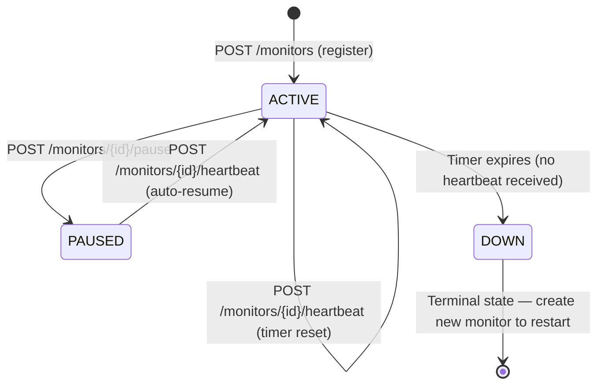
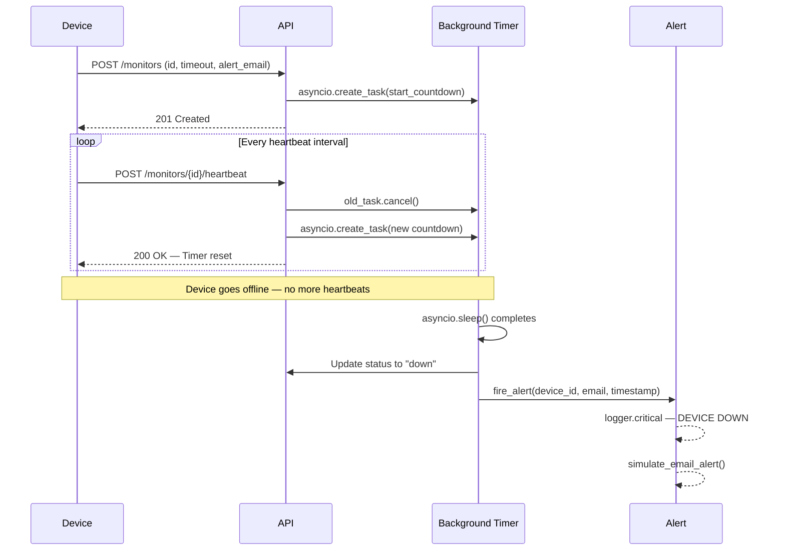
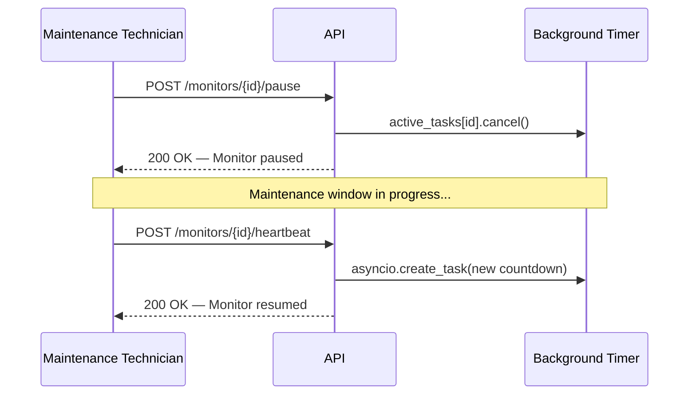
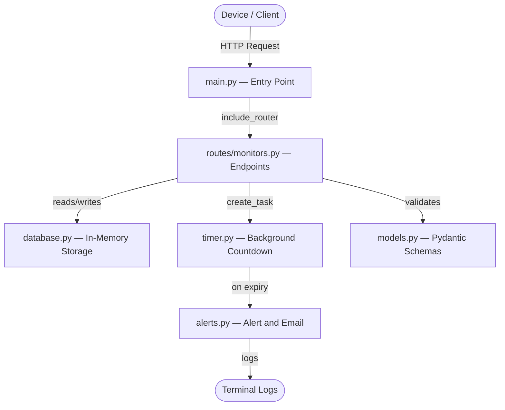

# 🚨 Pulse Check API
### Dead Man's Switch — Device Heartbeat Monitoring System

> *"Silence is not golden when it comes from a remote solar farm in the middle of nowhere."*

A production-grade backend REST API that monitors remote devices using **stateful countdown timers**. If a device stops sending heartbeats before its timer expires, the system automatically fires a critical alert and simulates an email notification to the responsible engineer.

Built for **CritMon Servers Inc.** — a critical infrastructure monitoring company managing remote solar farms and unmanned weather stations in low-connectivity areas.

---

## 🌐 Live Deployment

| Resource | URL |
|----------|-----|
| **Base URL** | `https://pulse-check-api-9fa8.onrender.com` |
| **Interactive Docs (Swagger)** | `https://pulse-check-api-9fa8.onrender.com/docs` |
| **Alternative Docs (ReDoc)** | `https://pulse-check-api-9fa8.onrender.com/redoc` |
| **Health Check** | `https://pulse-check-api-9fa8.onrender.com/` |

> ⚠️ Hosted on Render's free tier — the server may take ~30 seconds to wake up on first request.

---

## 📋 Table of Contents

- [The Problem](#-the-problem)
- [How It Works](#-how-it-works)
- [Architecture Diagrams](#-architecture-diagrams)
- [Project Structure](#-project-structure)
- [Tech Stack](#-tech-stack)
- [Setup Instructions](#-setup-instructions)
- [API Documentation](#-api-documentation)
- [Developer's Choice Feature](#-developers-choice-feature)
- [Engineering Decisions](#-engineering-decisions)
- [Production Roadmap](#-production-roadmap)

---

## 🔍 The Problem

CritMon manages hundreds of remote devices — solar farm controllers, weather stations, and sensors — deployed in areas with poor connectivity. These devices are supposed to send **"I'm alive"** signals every hour.

**The gap:** There was no automated way to know when a device went offline due to power failure, theft, or connectivity loss. Engineers only discovered failures when manually checking logs — sometimes hours or days later.

**The solution:** A **Dead Man's Switch API**. Devices register a monitor with a countdown timer. They must keep "defusing" it by sending heartbeats. If a device goes silent — the bomb goes off and an alert fires automatically.

---

## ⚙️ How It Works

```
Device registers → Timer starts → Device keeps pinging → Timer resets
                                         ↓
                              Device stops pinging
                                         ↓
                              Timer reaches zero → 🚨 ALERT FIRES
```

Think of it like a **bomb timer that devices must keep defusing**:

1. A device registers a monitor with a timeout (e.g. 60 seconds)
2. A background countdown timer starts **immediately**
3. The device must send a heartbeat **before** the timer hits zero
4. Each heartbeat **cancels** the old timer and starts a fresh one
5. If the device goes silent — the system marks it as `DOWN` and fires a critical alert

This pattern is known as a **Dead Man's Switch** — a fail-safe mechanism that triggers when expected activity **stops**.

---

## 🏗️ Architecture Diagrams

### State Diagram — Monitor Lifecycle



---

### Sequence Diagram — Normal Heartbeat Flow



---

### Sequence Diagram — Pause and Resume Flow



---

### Component Architecture Diagram



---

## 📁 Project Structure

The project follows a **modular architecture** based on the **Separation of Concerns** principle. Each file has one clear, single responsibility.

```
Pulse-Check-API/
│
├── main.py                 # Entry point — creates app, registers routes
├── models.py               # Pydantic schemas — request/response validation
├── database.py             # In-memory storage — monitors_db and active_tasks
├── alerts.py               # Structured logging and simulated email alerts
├── timer.py                # Background asyncio countdown logic
│
├── routes/
│   ├── __init__.py         # Makes routes/ a Python package
│   └── monitors.py         # All API endpoint handlers
│
├── requirements.txt        # Project dependencies
├── render.yaml             # Render cloud deployment config
├── .gitignore              # Excludes venv, __pycache__, .env
└── README.md               # This file
```

### Why this structure matters

| File | Owns | If you need to change... |
|------|------|--------------------------|
| `database.py` | Storage layer | Swap to PostgreSQL → only touch this file |
| `alerts.py` | Notification layer | Add real SendGrid email → only touch this file |
| `timer.py` | Timer logic | Change countdown behaviour → only touch this file |
| `models.py` | Data contracts | Add new request fields → only touch this file |
| `routes/monitors.py` | HTTP layer | Add or modify endpoints → only touch this file |

This means the codebase is **open for extension, closed for modification** — a core principle of clean software architecture.

---

## 🛠️ Tech Stack

| Tool | Purpose |
|------|---------|
| **FastAPI** | Web framework — native async support and auto-generated docs |
| **Uvicorn** | ASGI server — runs the async FastAPI application |
| **Pydantic** | Data validation — rejects malformed requests automatically |
| **asyncio** | Concurrent background timers without threading overhead |
| **logging** | Structured, timestamped, levelled logs across all modules |
| **Python 3.12** | Runtime |
| **Render** | Cloud deployment platform |

### Why FastAPI over Django or Node.js?

**vs Django:** Django is a full web framework built for monolithic applications — it includes templating, ORM, and admin panels that this project doesn't need. FastAPI is purpose-built for APIs with native async support that maps directly to our timer architecture.

**vs Node.js:** Python's `asyncio` integrates more naturally with FastAPI's async model. The Pydantic validation layer also provides cleaner, more explicit data contracts than plain JavaScript objects.

**FastAPI's key advantage here:** `asyncio.create_task()` runs background timers concurrently in a single thread — far more efficient than spawning OS threads for each device timer.

---

## 🚀 Setup Instructions

### Prerequisites

- Python 3.8 or higher
- pip
- Git

### Local Installation

```bash
# 1. Clone the repository
git clone https://github.com/mhiskall282/Pulse-Check-API.git
cd Pulse-Check-API

# 2. Create a virtual environment
# This isolates project dependencies from your system Python
python -m venv venv

# 3. Activate the virtual environment
# Windows:
venv\Scripts\activate
# Mac/Linux:
source venv/bin/activate

# 4. Install all dependencies
pip install -r requirements.txt

# 5. Start the development server
# --reload means the server restarts automatically when you save changes
uvicorn main:app --reload
```

### Verify It's Running

| URL | What you see |
|-----|-------------|
| `http://localhost:8000` | Health check JSON response |
| `http://localhost:8000/docs` | Interactive Swagger UI — test all endpoints live |
| `http://localhost:8000/redoc` | Clean ReDoc documentation |

### Quick Test (curl)

```bash
# 1. Register a monitor with a 30 second timeout
curl -X POST http://localhost:8000/monitors \
  -H "Content-Type: application/json" \
  -d '{"id": "device-123", "timeout": 30, "alert_email": "admin@critmon.com"}'

# 2. Send a heartbeat (resets the timer)
curl -X POST http://localhost:8000/monitors/device-123/heartbeat

# 3. Check status
curl http://localhost:8000/monitors/device-123

# 4. View heartbeat history
curl http://localhost:8000/monitors/device-123/history

# Wait 30 seconds without sending a heartbeat
# Watch the 🚨 alert fire in your terminal automatically
```

---

## 📡 API Documentation

### Base URL
```
Local:  http://localhost:8000
Live:   https://pulse-check-api-9fa8.onrender.com
```

### Endpoint Summary

| Method | Endpoint | Description | Code |
|--------|----------|-------------|------|
| `GET` | `/` | Health check | 200 |
| `POST` | `/monitors` | Register a new device monitor | 201 |
| `POST` | `/monitors/{id}/heartbeat` | Reset the countdown timer | 200 |
| `POST` | `/monitors/{id}/pause` | Pause monitoring for maintenance | 200 |
| `GET` | `/monitors` | List all monitors | 200 |
| `GET` | `/monitors/{id}` | Get a single monitor's status | 200 |
| `GET` | `/monitors/{id}/history` | Get heartbeat audit log ⭐ | 200 |

---

### 1. `GET /` — Health Check

**Response `200 OK`:**
```json
{
  "message": "Pulse Check API is running",
  "version": "1.0.0",
  "docs": "/docs",
  "redoc": "/redoc"
}
```

---

### 2. `POST /monitors` — Register a Monitor

Registers a new device and immediately starts its countdown timer.

**Request Body:**
```json
{
  "id": "device-123",
  "timeout": 60,
  "alert_email": "admin@critmon.com"
}
```

| Field | Type | Required | Description |
|-------|------|----------|-------------|
| `id` | string | ✅ | Unique identifier for the device |
| `timeout` | integer | ✅ | Seconds before alert fires — must be greater than 0 |
| `alert_email` | string | ✅ | Email address to notify when device goes down |

**Success Response `201 Created`:**
```json
{
  "message": "Monitor created for device 'device-123'",
  "device_id": "device-123",
  "timeout": 60,
  "status": "active"
}
```

**Error Responses:**

| Code | Reason |
|------|--------|
| `400` | Device ID already exists |
| `400` | Timeout is 0 or negative |
| `422` | Missing required fields — Pydantic auto-validation |

---

### 3. `POST /monitors/{id}/heartbeat` — Send Heartbeat

Resets the countdown timer. Automatically resumes a paused monitor.

**Success Response `200 OK`:**
```json
{
  "message": "Heartbeat received. Timer reset for 'device-123'",
  "device_id": "device-123",
  "timeout": 60,
  "last_heartbeat": "2026-03-01T10:34:22.123456",
  "status": "active"
}
```

| Code | Reason |
|------|--------|
| `404` | Device not found — register it first |
| `400` | Device is already down — create a new monitor |

---

### 4. `POST /monitors/{id}/pause` — Pause a Monitor

Stops the countdown completely. No alert fires while paused.
Use during planned maintenance windows to prevent false alarms.

**Success Response `200 OK`:**
```json
{
  "message": "Monitor 'device-123' paused. Send a heartbeat to resume.",
  "device_id": "device-123",
  "status": "paused"
}
```

**To resume:** Send any heartbeat — it automatically restarts the timer.

---

### 5. `GET /monitors` — List All Monitors

**Response `200 OK`:**
```json
{
  "monitors": [...],
  "total": 3
}
```

---

### 6. `GET /monitors/{id}` — Get Monitor Status

**Response `200 OK`:**
```json
{
  "id": "device-123",
  "timeout": 60,
  "alert_email": "admin@critmon.com",
  "status": "active",
  "created_at": "2026-03-01T10:30:00.000000",
  "last_heartbeat": "2026-03-01T10:34:22.123456",
  "heartbeat_history": []
}
```

**Status values:**

| Status | Meaning |
|--------|---------|
| `active` | Timer running, device being monitored |
| `paused` | Timer stopped, no alert will fire |
| `down` | Timer expired, alert fired, device is offline |

---

### 7. `GET /monitors/{id}/history` — Heartbeat History ⭐

**Response `200 OK`:**
```json
{
  "device_id": "device-123",
  "status": "active",
  "total_heartbeats": 5,
  "first_heartbeat": "2026-03-01T10:31:00.000000",
  "last_heartbeat": "2026-03-01T10:34:22.123456",
  "history": [
    {
      "received_at": "2026-03-01T10:31:00.000000",
      "event": "heartbeat",
      "timer_reset_to": 60
    }
  ]
}
```

---

### Alert Output

When a timer expires the following is logged to the console:

```
2026-03-01 10:35:00 — CRITICAL — [alerts] — 🚨 DEVICE DOWN
2026-03-01 10:35:00 — CRITICAL — [alerts] — {"ALERT": "Device device-123 is DOWN!", "time": "...", "alert_email": "admin@critmon.com"}
2026-03-01 10:35:00 — INFO    — [alerts] — 📧 SIMULATING EMAIL ALERT
2026-03-01 10:35:00 — INFO    — [alerts] —    To:      admin@critmon.com
2026-03-01 10:35:00 — INFO    — [alerts] —    Subject: CRITICAL — Device 'device-123' is offline
2026-03-01 10:35:00 — INFO    — [alerts] —    Body:    Immediate action required.
```

---

## ⭐ Developer's Choice Feature

### Heartbeat History Log — `GET /monitors/{id}/history`

**The gap I identified:**

The original spec tracks a device's *current state* but has no memory of past behaviour. When an alert fires, an on-call engineer faces a critical question: *"Was this sudden, or was it coming?"*

Without history, the system is **reactive but not diagnostic**.

**What I built:**

Every heartbeat is appended to a `heartbeat_history` log on the monitor object. The `/history` endpoint exposes this with summary statistics — total heartbeats, first ping, last ping, and the full chronological trail.

**Why this matters in production:**

Real monitoring tools — **AWS CloudWatch**, **Datadog**, **Grafana**, **PagerDuty** — are built on this exact principle. Time-series event logs let engineers:

- Detect devices that are "barely alive" — pinging less and less frequently
- Reconstruct the exact timeline of an incident
- Identify patterns across multiple device failures
- Make data-driven decisions about hardware replacement schedules

**In production:** Stored in **InfluxDB** or **TimescaleDB** — databases purpose-built for time-series data with retention policies and aggregation queries.

---

## 🧠 Engineering Decisions

### Why asyncio instead of threading?

Each device needs its own running timer. Two options:

- **Threading:** One OS thread per timer. At 1,000 devices = 1,000 threads. Each thread consumes ~8MB of stack memory and adds context-switching overhead.
- **asyncio (chosen):** Single-threaded event loop. `asyncio.sleep()` yields control without blocking. The loop efficiently multiplexes thousands of coroutines. Used by Discord, Nginx, and FastAPI itself.

For a system tracking potentially hundreds of devices, asyncio is the correct choice.

### Why store `active_tasks` separately?

When a heartbeat arrives we need to **cancel** the running timer. Without a reference to the running task, there is no handle to cancel it. `active_tasks` maps device IDs to their `asyncio.Task` objects — giving precise control over every running timer.

### Why in-memory storage?

The spec required a working prototype. A dictionary is the simplest, fastest implementation that correctly demonstrates the pattern. The tradeoff — data loss on restart — is acceptable at this scope. In production: PostgreSQL for monitor records, Redis for timer state (Redis has native TTL support, perfect for countdowns).

### Why `try/except CancelledError` in timer.py?

When a heartbeat cancels a timer, Python raises `asyncio.CancelledError` inside the sleeping coroutine. Without catching it, every successful heartbeat would log an unhandled exception. The `except` block catches the cancellation and returns silently — because cancellation from a heartbeat is **expected, normal behaviour**, not an error.

---

## 🔮 Production Roadmap

| Priority | Feature | Implementation |
|----------|---------|----------------|
| 🔴 High | **Authentication** | JWT tokens via FastAPI OAuth2 |
| 🔴 High | **Persistent storage** | PostgreSQL via SQLAlchemy |
| 🔴 High | **Real email alerts** | SendGrid or AWS SES |
| 🟡 Medium | **Redis timer state** | Replace active_tasks with Redis TTL keys |
| 🟡 Medium | **DELETE /monitors/{id}** | Deregister retired devices |
| 🟡 Medium | **Rate limiting** | Prevent heartbeat spam |
| 🟢 Low | **Time-series DB** | InfluxDB for heartbeat_history |
| 🟢 Low | **WebSocket support** | Real-time dashboard status updates |
| 🟢 Low | **Docker** | Containerise for consistent deployments |

---

## 👤 Author

**John Okyere**
- GitHub: [@mhiskall282](https://github.com/mhiskall282)
- LinkedIn: [linkedin.com/in/johnokyere](https://www.linkedin.com/in/johnokyere/)

---

*Built for the AmaliTech NSS Capstone Challenge 2026 — Systems Engineering Specialisation*
