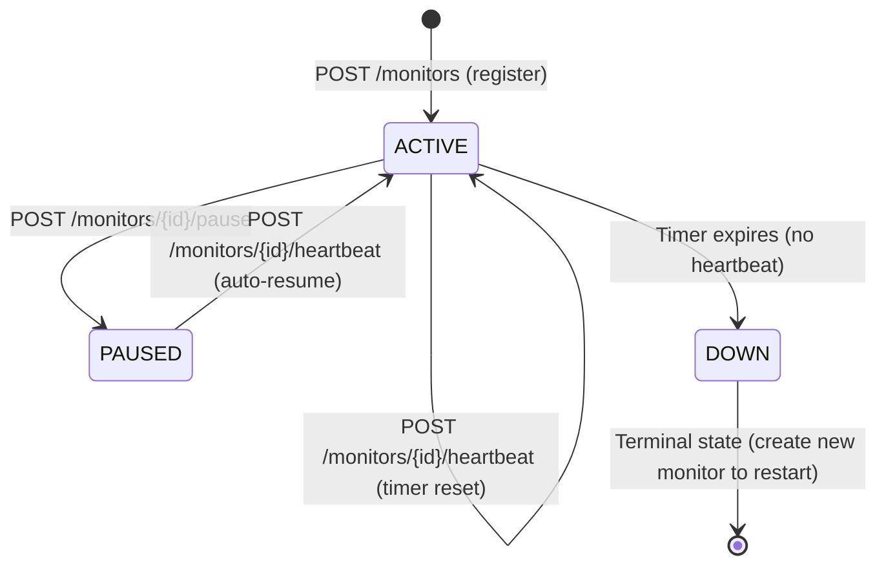
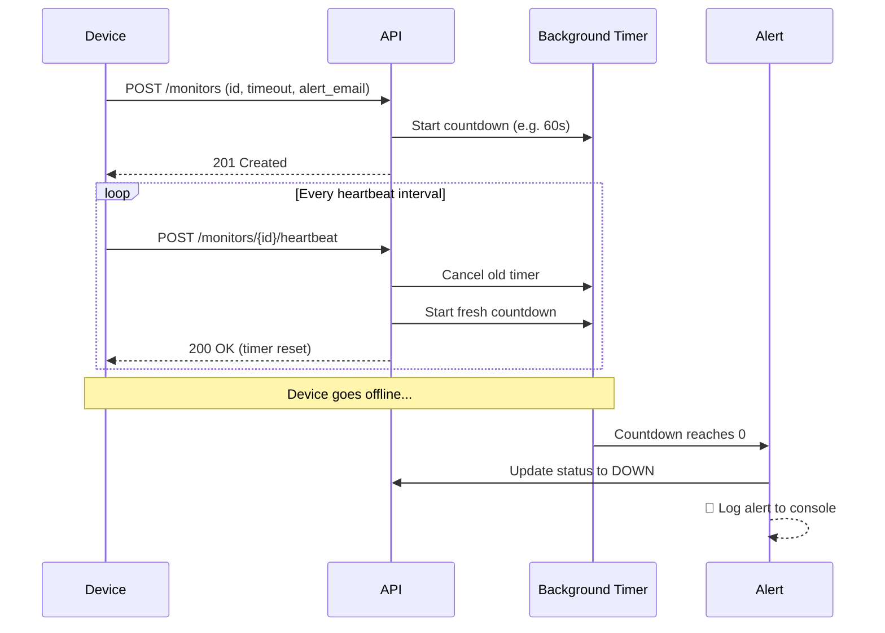
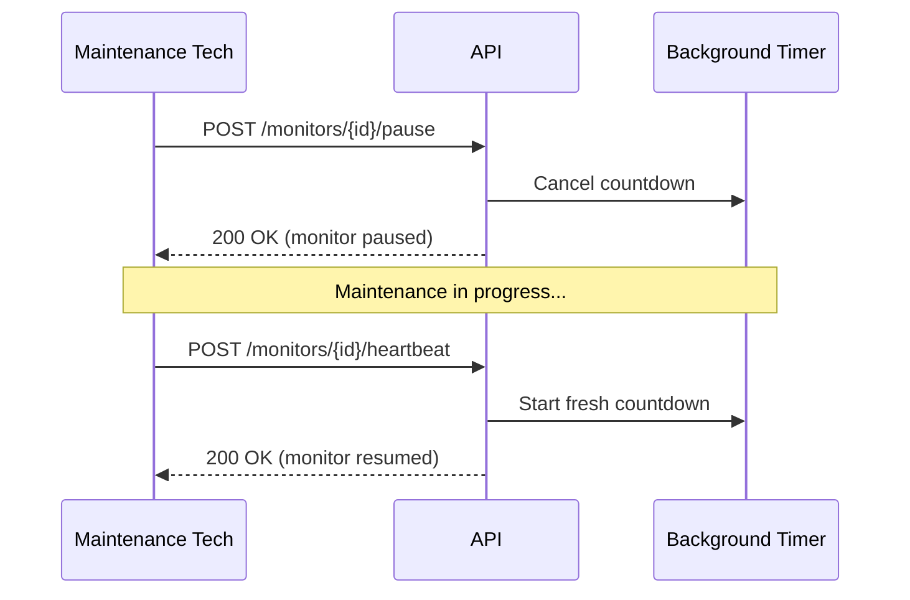

# Pulse Check API 🚨
### Dead Man's Switch — Device Heartbeat Monitoring System

A backend REST API that monitors remote devices by managing stateful countdown timers. If a device stops sending heartbeats before its timer expires, the system automatically fires an alert.

Built with **FastAPI** (Python) — chosen for its native async support, automatic API documentation, and clean syntax for building high-performance backend services.

---

## Table of Contents
- [Architecture Diagram](#architecture-diagram)
- [How It Works](#how-it-works)
- [Setup Instructions](#setup-instructions)
- [API Documentation](#api-documentation)
- [Developer's Choice Feature](#developers-choice-feature)
- [Tech Stack](#tech-stack)

---

## Architecture Diagram

### State Diagram — Monitor Lifecycle



### Sequence Diagram — Normal Heartbeat Flow



### Sequence Diagram — Pause Flow



---

## How It Works

Think of it like a **bomb timer that devices must keep defusing**.

1. A device registers a monitor with a timeout (e.g. 60 seconds)
2. A background countdown timer starts immediately
3. The device must send a heartbeat before the timer hits zero
4. Each heartbeat cancels the old timer and starts a fresh one
5. If the device goes silent — the timer fires an alert automatically

This pattern is known as a **Dead Man's Switch** — a fail-safe that triggers when activity stops.

---

## Setup Instructions

### Prerequisites
- Python 3.8+
- pip

### Installation

```bash
# 1. Clone the repository
git clone https://github.com/mhiskall282/Pulse-Check-API.git
cd Pulse-Check-API

# 2. Create and activate virtual environment
python -m venv venv

# Windows
venv\Scripts\activate

# Mac/Linux
source venv/bin/activate

# 3. Install dependencies
pip install -r requirements.txt

# 4. Start the server
uvicorn main:app --reload
```

### Verify It's Running

Open your browser and go to:
- **Health check:** `http://localhost:8000`
- **Interactive API docs:** `http://localhost:8000/docs`
- **Alternative docs:** `http://localhost:8000/redoc`

---

## API Documentation

### Base URL
```
http://localhost:8000
```

---

### 1. Register a Monitor
**`POST /monitors`**

Registers a new device and starts its countdown timer.

**Request Body:**
```json
{
  "id": "device-123",
  "timeout": 60,
  "alert_email": "admin@critmon.com"
}
```

**Success Response — `201 Created`:**
```json
{
  "message": "Monitor created for device 'device-123'",
  "device_id": "device-123",
  "timeout": 60,
  "status": "active"
}
```

**Error — `400 Bad Request`** (duplicate ID or invalid timeout)

---

### 2. Send Heartbeat (Reset Timer)
**`POST /monitors/{id}/heartbeat`**

Resets the countdown timer for a device. If the monitor was paused, this automatically resumes it.

**Example:** `POST /monitors/device-123/heartbeat`

**Success Response — `200 OK`:**
```json
{
  "message": "Heartbeat received. Timer reset for 'device-123'",
  "device_id": "device-123",
  "timeout": 60,
  "last_heartbeat": "2026-02-21T10:34:22.123456",
  "status": "active"
}
```

**Error — `404 Not Found`** (device doesn't exist)

**Error — `400 Bad Request`** (device is already down)

---

### 3. Pause a Monitor
**`POST /monitors/{id}/pause`**

Stops the countdown timer completely. No alert will fire while paused.
Sending a heartbeat will automatically resume the monitor.

**Example:** `POST /monitors/device-123/pause`

**Success Response — `200 OK`:**
```json
{
  "message": "Monitor 'device-123' paused. Send a heartbeat to resume.",
  "device_id": "device-123",
  "status": "paused"
}
```

---

### 4. Get Monitor Status
**`GET /monitors/{id}`**

Returns the current state of a single monitor.

**Example:** `GET /monitors/device-123`

**Success Response — `200 OK`:**
```json
{
  "id": "device-123",
  "timeout": 60,
  "alert_email": "admin@critmon.com",
  "status": "active",
  "created_at": "2026-02-21T10:30:00.000000",
  "last_heartbeat": "2026-02-21T10:34:22.123456",
  "heartbeat_history": []
}
```

---

### 5. List All Monitors
**`GET /monitors`**

Returns all registered monitors and their current statuses.

**Success Response — `200 OK`:**
```json
{
  "monitors": [...],
  "total": 3
}
```

---

### 6. Get Heartbeat History ⭐ Developer's Choice
**`GET /monitors/{id}/history`**

Returns the full heartbeat audit log for a device.

**Example:** `GET /monitors/device-123/history`

**Success Response — `200 OK`:**
```json
{
  "device_id": "device-123",
  "status": "active",
  "total_heartbeats": 5,
  "first_heartbeat": "2026-02-21T10:31:00.000000",
  "last_heartbeat": "2026-02-21T10:34:22.123456",
  "history": [
    {
      "received_at": "2026-02-21T10:31:00.000000",
      "event": "heartbeat",
      "timer_reset_to": 60
    }
  ]
}
```

---

## Developer's Choice Feature

### Heartbeat History Log — `GET /monitors/{id}/history`

**The problem I identified:**

The original spec tracks a device's *current state* but has no memory. Engineers responding to an alert can't answer critical questions like:
- Was this device pinging consistently before it died?
- Did it start pinging less frequently recently?
- When exactly was the last time it was healthy?

Without this, the monitoring system is reactive but not diagnostic.

**What I built:**

Every heartbeat is appended to a `heartbeat_history` log stored on the monitor. The `/history` endpoint exposes this log with summary statistics — total heartbeats, first ping, last ping, and the full chronological trail.

**Why this matters in production:**

Real infrastructure monitoring tools like **AWS CloudWatch**, **Datadog**, and **Grafana** are built on this principle — capturing time-series event data so engineers can audit system behaviour before and after incidents. This feature brings that observability mindset to the Pulse Check API.

---

## Tech Stack

| Tool | Purpose |
|------|---------|
| **FastAPI** | Web framework — chosen for native async support and auto-generated docs |
| **Uvicorn** | ASGI server — runs the FastAPI app |
| **Pydantic** | Data validation — ensures incoming JSON has correct fields and types |
| **asyncio** | Background timers — runs countdowns without blocking the API |
| **Python 3.12** | Runtime |

---

## Project Structure

```
Pulse-Check-API/
├── main.py              # All API routes and business logic
├── requirements.txt     # Project dependencies
├── .gitignore           # Excludes venv, __pycache__, .env
└── README.md            # This file
```

---

*Built by John Okyere — AmaliTech NSS Capstone Challenge 2026*